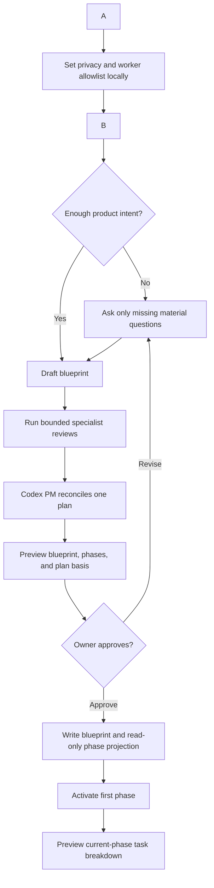
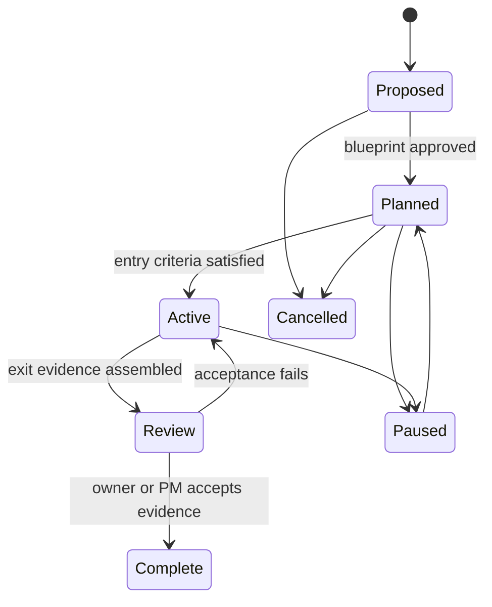

# Project Blueprints and Phase Planning

Status: reviewed product design; Phase 1 and Phase 2 are implemented locally, and Phase 4 dependency authoring is complete across backend, API, and dashboard
Owner: Codex PM
Cortex work item: `1e262baed22c`

Independent review: Claude Opus architecture review and Grok 4.5 adversarial
review. Both approved the direction conditionally and recommended cutting the
first release to the blueprint contract, safe onboarding, structured plan
basis, and a read-only phase rail before task-decomposition automation.

## Implementation status

The first Phase 1 foundation is implemented in the active worktree:

- additive schema for blueprint drafts, immutable revisions, phases, phase
  dependencies, and task-to-phase references;
- minimum-contract validation plus exact preview fingerprint and expected-file
  hash approval gates;
- exclusive creation, rollback, owner-document non-overwrite protection, and
  external-edit staleness detection;
- one-primary-active-phase validation and a read-only dashboard phase rail;
- guided-draft execution hold while legacy `missing` projects remain operable;
- removal counts and active-phase blockers in the existing guarded removal
  transaction;
- backend preview/approval endpoints with local action-token protection and
  regression coverage.
- restart-safe exact approval bundles stored with the local draft; reopening the
  dashboard returns the same Markdown, phases, writes, and fingerprint, and
  approval reloads that server-stored payload instead of trusting browser content;
- resumable CLI and dashboard interviews that ask the five material product
  questions, define only the current phase, preserve answers across sessions,
  and generate the same deterministic exact-approval preview;
- an attributed `Build project blueprint` planning task and PM session that
  close only when the owner approves the revision;
- guided onboarding as the recommended post-registration path, while explicit
  quick registration remains available and visibly leaves `Blueprint needed`.

The first Phase 2 vertical slice is also implemented locally:

- `Break down current phase` builds a deterministic, exact-fingerprint preview
  from the approved active phase's uncovered exit criteria;
- the preview explicitly creates no tasks, starts no agents, and contacts no
  provider;
- owner approval creates ordinary Cortex suggestions only, linked to the
  immutable blueprint revision, phase, and exit-criterion reference;
- the existing suggestion approval path remains the sole task-conversion gate
  and copies phase and criterion references onto the assigned task;
- stale blueprints, inactive phases, missing criteria, preview drift, and
  already-linked criteria fail closed;
- the dashboard exposes the review/approval flow and tags resulting
  recommendations by phase and criterion.

The second Phase 2 vertical slice is implemented locally:

- Cortex assembles evidence pointers only from criterion-linked tasks that have
  reached `review` or `done`, plus their latest completed run when present;
- the owner accepts each exact evidence bundle through an immutable,
  fingerprinted criterion-evidence record;
- phase progress is derived only from accepted exit criteria and exposes the
  accepted count, total count, percentage, evidence pointers, and acceptance
  attribution; task percentages and model estimates never contribute;
- an active phase moves to `review` only after every exit criterion has accepted
  evidence and the owner approves an exact transition fingerprint;
- the transition does not complete the phase, create a task, or start an agent;
- evidence acceptance and phase review are exposed through local action-token
  protected APIs and a responsive dashboard review surface.

The third Phase 2 vertical slice is implemented locally:

- current phase status can advance from `review` to `complete` only through an
  exact fingerprint; evidence cannot drift.
- optional next planned phase activation is computed and applied in the same
  approved transition when dependency blockers are not present.
- dependency metadata is persisted in `phase_dependencies` and included in phase
  projection rows.
- dashboard phase-evidence modal now supports both transitions and explains when
  dependency blockers prevent next-phase activation.

The Phase 4 dependency-authoring surface is implemented locally:

- approved projects with multiple phases expose a dashboard dependency editor;
- the owner selects one planned phase and only earlier phases are offered as
  blockers;
- the editor previews the exact replacement edge set and states that no
  blueprint, task, or agent execution is changed;
- the guarded API applies the replacement atomically and the refreshed project
  rail reflects the persisted blocker set;
- desktop and 390x844 rendered QA verified the interaction with no console
  warnings or errors.

The owner-facing design and portfolio surfaces are implemented locally:

- the Roadmap can filter one project and switch between tasks, delivery phases,
  or both without inventing dates for unscheduled work;
- the project drawer opens the approved blueprint Markdown and plan-basis
  provenance from the guarded local content endpoint;
- Mermaid blocks render through a bundled, conditionally loaded renderer in
  strict mode, reject executable or remote-loading SVG output, and retain a
  source fallback without loading remote scripts.

Remaining to complete end-to-end rollout:

- commit and review the exact implementation SHA after full regression and
  desktop/mobile browser verification;
- dogfood approval on one newly registered and one existing project;
- after dogfood, complete the Phase 3 comparison of planned criteria, accepted
  outcomes, rework, recurring evidence gaps, and stale phases.

## Recommendation

Add a **Project Blueprint** layer to Cortex between the project record and its
execution tasks. Every active project should have a versioned blueprint that
explains what is being built, the workflow it supports, the phased delivery
plan, the evidence behind that plan, and the current phase. Cortex should then
turn only the current or next approved phase into bounded work for specialist
AI workers.

This fits Cortex's role as the canonical PM control plane. It should not become
a second source repository or a document-authoring system. The human-readable
blueprint remains a Git-tracked Markdown artifact inside the project; Cortex
stores the normalized phase, milestone, task, decision, and evidence records
needed to operate it.

## Problem

Today Cortex can answer what work exists, who is doing it, what is blocked, and
what evidence was captured. It cannot reliably answer:

- What is this project designed to become?
- What user or business workflow is it meant to support?
- Which delivery phase is current, and what gates completion?
- Which future phases are planned but intentionally not active?
- Why were these phases and tasks chosen?
- Which AI reviewers contributed, what did they disagree about, and what did
  the PM accept or reject?

The existing `.cortex/state.md` is deliberately compact and current. Expanding
it into a permanent design document would mix durable intent with changing
status and make the context compiler noisy. A separate artifact is required.

## Product principles

1. **Blueprint before guided execution.** A project created through the guided
   onboarding flow does not become execution-ready until its minimum blueprint
   and first phase are approved. Existing projects and explicit quick-register
   paths remain operable but are visibly labeled `Blueprint needed`.
2. **Discover before asking.** Cortex reads existing repository documentation,
   code structure, tests, and recorded decisions before asking the owner.
3. **Ask only material questions.** Questions cover missing product intent,
   authority, constraints, deadlines, or success criteria—not facts available
   in the repository.
4. **One accountable synthesis.** Specialist outputs are evidence. Codex PM
   reconciles them into one plan and records accepted, rejected, and unresolved
   findings.
5. **Plan deeply, schedule selectively.** Future phases need outcomes and gates;
   only the current and next phase need task-level decomposition.
6. **Preview before mutation.** Blueprint files, phase records, and generated
   tasks are shown for review before Cortex writes or activates them.
7. **Never overwrite owner documents.** Existing design and roadmap files are
   referenced or imported with explicit provenance.

## Canonical artifacts

Each repository may contain:

```text
.cortex/
  blueprint.md       durable product/design intent, workflow, and phases
  state.md           regenerated current state and recent evidence
```

`blueprint.md` is human-reviewable and Git-tracked. Cortex records its path,
content hash, revision, approval state, and source PM session. The database is
the operational projection for phases and tasks; the Markdown document is the
portable design artifact.

### Minimum blueprint contract

```markdown
# Project Blueprint

## Purpose and intended users
## Problem and desired outcomes
## Current baseline
## Scope and non-goals
## Constraints and safeguards
## Success measures
## Product or operational workflow
## Architecture and key boundaries
## Delivery phases
## Risks, assumptions, and open decisions
## Plan basis and review provenance
```

The workflow section should use Mermaid when a sequence, state transition, or
role handoff is materially easier to understand visually. A prose-only workflow
is valid for small projects.

## Guided PM creation workflow

Introduce `cortex project onboard <repo-path>` as the guided, owner-facing
command. Keep `cortex init` as the lower-level registration/scaffolding command
for scripts and advanced users. `cortex pm` remains the existing namespace for
attributed PM sessions.

The guided flow creates a normal planning work item and PM session as its first
local record. This keeps onboarding questions, reviews, decisions, and approval
attributable without inventing a separate PM-session system.



### Discovery

Cortex inspects only bounded, relevant evidence. Repository discovery reuses
the existing `evidence.bundle()` file, size, suffix, and blocked-name limits.
Anything sent to a cloud reviewer passes the deterministic secret/privacy scan
first. Registration, privacy selection, and local discovery do not contact a
provider.

- existing README, design, ADR, roadmap, handoff, and status files;
- repository stack, tests, important directories, and Git state;
- existing Cortex goal, decisions, tasks, runs, and PM activity;
- privacy level and worker allowlist.

### Questions

The command asks a short adaptive interview rather than a fixed questionnaire.
The maximum initial set should normally be five questions:

1. Who is this for, and what problem should become easier?
2. What observable outcome would make the project worthwhile?
3. What must this project not do?
4. What deadline, external dependency, or business constraint matters?
5. What decision is still genuinely open?

Repository evidence should prefill proposed answers. The owner confirms or
corrects them. Partial answers and the discovery hash are stored locally in a
`project_blueprint_drafts` record, so the command and dashboard interview can
stop and resume without writing into the repository or losing answers.

### Review council

Do not require every configured provider on every project. Choose reviewers by
decision need and allowlist:

- Codex PM: integration, prioritization, and final acceptance;
- Claude: architecture and specification review;
- Grok: adversarial assumptions and product blind spots;
- Gemini: broad repository and dependency synthesis;
- Ollama: restricted/local-only triage and inexpensive document review.

A consequential blueprint may use two independent specialist reviews. The
first release uses at most one allowed specialist unless a high-risk decision
genuinely needs an independent challenge. A small or well-documented project
may use none. The reviewer set is always a subset of the confirmed project
allowlist. Restricted projects can reach approval through owner answers,
repository evidence, Codex PM synthesis, and local-only review; cloud review is
never required. A provider failure is recorded as missing evidence, not
silently treated as agreement.

## Phase model

Every execution-ready project has exactly one **primary current phase** for the
project view. Parallel tasks or workstreams may exist inside it. A phase
contains:

- name and ordinal;
- status: `proposed`, `planned`, `active`, `review`, `complete`, `paused`, or
  `cancelled`;
- intended outcome and explicit non-goals;
- entry criteria and observable exit criteria;
- dependencies on earlier phases or external decisions;
- optional target dates and milestone links;
- progress derived from accepted outcomes, not model self-report;
- PM session and blueprint revision that authorized it.



Future phases remain outcome-level plans. Cortex expands the active phase and,
when useful, the immediately next phase. It should not create a large backlog
of speculative AI tasks that becomes stale before execution.

## Task decomposition and AI work

`Break down current phase` creates a preview, not tasks. The PM compiler turns
the approved phase into the fewest bounded assignments that collectively meet
its exit criteria. Each proposed task includes:

- one concrete outcome;
- done-when evidence;
- scope and allowed paths;
- dependencies and milestone;
- risk, action type, and owner/worker recommendation;
- reviewer or acceptance gate;
- the blueprint revision and phase criterion it advances.

After owner approval, Cortex creates ordinary Cortex suggestions scoped to the
phase. Approving those suggestions creates tasks through the existing
suggestion-to-task path and routes them through the
project allowlist. Multiple AI workers may contribute in parallel only when
their outputs are genuinely independent. Codex PM remains responsible for
integration, contradiction resolution, verification, and phase acceptance.

## Plan basis and multi-AI provenance

The dashboard must distinguish the final plan from the evidence used to make
it. For every blueprint or phase plan, show:

- repository and document evidence inspected;
- owner answers and decisions;
- specialist reviewers, models, and bounded questions;
- accepted findings and how they changed the plan;
- rejected findings and the PM rationale;
- disagreements or evidence gaps still open;
- blueprint revision and approval event.

Use existing task-linked PM sessions and append-only activity events for this
provenance. `planning.contribution_recorded` events use a required evidence
shape: `finding_id`, reviewer, model, bounded question, finding, disposition
(`accepted`, `rejected`, or `unresolved`), rationale, blueprint revision, and
artifact reference. Add a dedicated contribution table only if this closed
event contract proves insufficient.

## Dashboard project view

The project drill-down should lead with design and phase context, not the raw
task list.

1. **Project header:** current outcome, current phase, phase health, next gate,
   and owner decision if one is required.
2. **Phase rail:** completed, current, and planned phases with explicit gates;
   no invented dates.
3. **Current phase:** outcome, entry/exit criteria, progress evidence,
   blockers, and approved tasks.
4. **Design:** rendered blueprint with revision, approval state, and source
   file link.
5. **Workflow:** rendered Mermaid/prose workflow and role handoffs.
6. **Plan basis:** AI contributions, owner decisions, accepted/rejected
   findings, and open gaps.
7. **Evidence timeline:** existing PM, task, run, test, review, and acceptance
   events filtered to this project or phase.

Projects without a blueprint show `Blueprint needed` and one action:
`Build project blueprint`. They remain visible in the portfolio and keep their
existing work; Cortex does not fabricate phases from task titles.

### Execution-readiness policy

| Entry path | Initial blueprint state | Existing work | New plan/dispatch |
| --- | --- | --- | --- |
| Guided `project onboard` | `draft` | Not applicable | Held until blueprint and first phase approval |
| Dashboard/CLI quick registration | `missing` | Allowed | Allowed with persistent `Blueprint needed` warning |
| Migrated existing project | `missing` | Unchanged | Unchanged; guided backfill is recommended |
| Approved blueprint | `approved` | Allowed | Allowed under normal task and worker safeguards |
| Externally edited blueprint | `stale` | Active work is not cancelled | New phase breakdown held pending reconciliation |

This preserves backward compatibility while making the guided path trustworthy.
The dashboard Add flow should make guided onboarding primary and label quick
registration as the advanced bypass.

## Data model changes

### `projects`

- retain existing `status`; do not introduce a competing lifecycle state;
- `blueprint_path`, `blueprint_hash`;
- `blueprint_status`: `missing`, `draft`, `review`, `approved`, `stale`;
- `current_blueprint_revision_id`, `current_phase_id`.

### `project_blueprint_drafts`

- `project_id`, `stage`, `answers_json`, `discovery_hash`, timestamps;
- local and resumable; deleted after approval or explicit abandonment.

### `project_blueprint_revisions`

- immutable revision id, project id, ordinal, path, content hash;
- immutable Markdown content or an artifact reference so non-Git/deferred
  projects retain revision history;
- status, PM session, approving actor and time;
- source Git commit when one exists, plus structured plan-basis evidence.

### `project_phases`

- `id`, `project_id`, `ordinal`, `name`, `status`;
- `outcome`, `non_goals`, `entry_criteria`, `exit_criteria`;
- `start_at`, `target_at`, `completed_at`;
- `blueprint_revision`, `pm_session_id`, timestamps.

### `phase_dependencies`

- `phase_id`, `depends_on_phase_id`, `type` (`blocks` initially).

### `tasks`

- add `phase_id` and `exit_criterion_ref`;
- retain existing `parent_id`, `milestone`, dates, dependencies, progress,
  assignee, acceptance, and evidence links.

A phase is the project's primary delivery slice. A milestone remains an
optional named deliverable within a phase; it is not a second phase system.
Roadmap bars still require recorded dates and never infer a schedule from phase
order.

All new project-owned tables use explicit foreign keys and deletion behavior.
Project-removal preview/count/delete coverage and active-phase blockers are part
of the same schema change, not deferred cleanup.

## Blueprint file lifecycle

- Creation uses the same exclusive-create and rollback discipline as the
  existing initial state file.
- Existing design/roadmap/ADR files may be linked as authoritative sources;
  Cortex does not require a duplicate document when they already satisfy the
  contract.
- A revision preview includes the expected current hash. Apply fails if the
  file changed after preview or the canonical worktree has unsafe local
  overlap.
- Cortex never commits the blueprint automatically. It records the file hash
  and an approving Git SHA when the owner later commits it.
- Non-Git or deferred-state projects still receive a local blueprint artifact
  when the selected folder is writable. The immutable revision record supplies
  history when Git cannot; an external/reference-only project may link an
  artifact instead of creating a file.
- Blueprint hash is rechecked on project open, PM session start, and before
  phase breakdown. Drift changes approved to stale and produces a
  reconciliation preview; it never rewrites phases or tasks silently.

## Safeguards

- Registration and discovery never contact an AI provider.
- The owner sees the questions and selects or confirms the allowed workers
  before review delegation.
- Restricted projects remain local unless the owner explicitly expands access.
- Existing design files and `.cortex/state.md` are never overwritten during
  preview or import.
- Blueprint approval is separate from task approval and task execution.
- AI cannot mark a phase complete; acceptance requires verified evidence and a
  Codex PM or owner judgment.
- Changing a blueprint marks affected planned phases stale and requires a
  reconciliation preview; it does not silently rewrite active work.
- The project-removal preview includes blueprint drafts/revisions, phases, and
  phase dependencies; active phases block removal until explicitly resolved.

## Migration

Existing projects are not blocked. They receive `blueprint_status=missing` and
remain operational. Cortex offers a guided backfill that uses current repository
evidence and PM history, then asks only for missing product decisions.

Dogfood the migration on:

1. `cortex-portfolio-control-plane` — documented internal product;
2. `trader-dan-landing` — active product with commercial workflows;
3. `apollo-ats` — restricted, high-risk workflow with strong human-control
   constraints.

The three projects intentionally exercise different privacy, documentation,
workflow, and phase-planning needs.

## Delivery plan

### Phase 1 — Trustworthy blueprint and read-only phase rail

- validate the Markdown contract and blueprint hash/revision;
- implement resumable `cortex project onboard` and matching dashboard
  interview using bounded discovery and adaptive questions;
- preview and approve before writing `.cortex/blueprint.md`;
- show `Blueprint needed`, draft, approved, and stale states;
- project one primary current phase plus planned phases and gates read-only;
- render sanitized local Markdown and Mermaid without loading remote scripts or
  allowing document HTML to execute;
- add schema/removal/staleness/provenance tests in the same slice.

Done when one new project and one existing project can produce an approved,
non-overwritten blueprint with complete provenance, and the project view shows
its current and planned phases without enabling automatic decomposition.

### Phase 2 — Approved phase-to-task decomposition

- preview phase-scoped Cortex suggestions mapped to exit criteria;
- owner approval creates tasks through the existing conversion path;
- add phase dependencies, transitions, evidence assembly, and phase filters;
- define progress as accepted exit criteria with evidence pointers, never an AI
  estimate.

Done when one approved phase can be decomposed, executed through existing
safeguards, and moved to review from linked evidence.

### Phase 3 — Planning quality after dogfood

- only after at least one complete phase on each dogfood project, compare
  planned criteria with accepted outcomes and rework;
- surface recurring evidence gaps and stale phases;
- consider reviewer-mix recommendations and selective baseline/slippage only
  where evidence proves value.

Done when the planning workflow demonstrably reduces owner re-explanation and
stale task creation across repeated PM sessions.

### Phase 4 — Dependency authoring and transition hardening

- owner-authored dependency updates are available for phases in the currently
  approved blueprint revision;
- replacement dependency ordinals are validated to earlier ordinals only, with no
  duplicates or unknown targets, and replacement edge sets are applied atomically;
- every edit writes a `phase.dependencies_updated` activity event with revision
  and phase-level evidence;
- transition exactness for review-to-complete and next-phase activation continues
  to use updated dependency blockers.

Done when an approved project's dependency graph can be edited post-approval with
validation and precise activity evidence, without re-submitting the whole blueprint,
and the completion gate reflects the updated dependency blockers.

## Acceptance criteria for the feature

1. A project created through guided onboarding cannot become execution-ready
   without an approved minimum blueprint and active first phase; direct legacy
   registration remains available and is visibly labeled `Blueprint needed`.
2. Existing projects remain usable and can be backfilled without overwriting
   repository documents.
3. The dashboard answers purpose, current phase, planned phases, next gate,
   approved tasks, and plan basis from one project view.
4. Current-phase task decomposition is previewed and owner-approved before
   creation or execution.
5. Every specialist contribution is attributable; Codex PM records whether it
   was accepted, rejected, or left unresolved.
6. Phase completion is based on verified exit evidence, never AI assertion.
7. Phase dependency authoring is a post-approval maintenance action that updates
   existing phase edges with validation and clear activity evidence.

## Non-goals

- requiring every AI provider to comment on every project;
- generating a complete speculative task backlog at project creation;
- replacing detailed repository architecture documents or ADRs;
- automatic phase completion, task acceptance, merge, deployment, or external
  communication;
- mandatory dates, resource leveling, timesheets, or full Microsoft Project
  scheduling.
